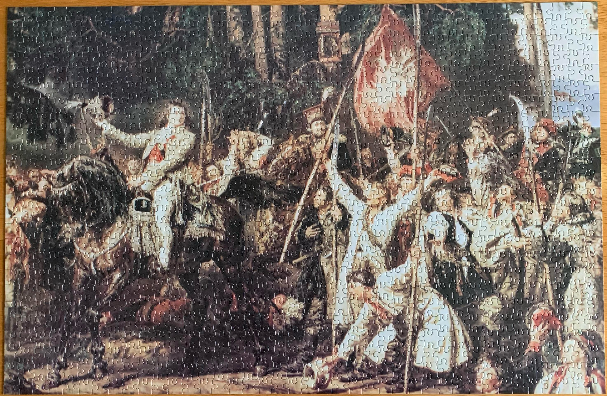

<a href="https://luffm.github.io/Jigsaw-Puzzles/">Jigsaw Puzzles</a>

## Kościuszko pod Racławicami (Jan Matejko, 1888)
2022-02-23 

 1000 pieces

<a href="https://luffm.github.io/Jigsaw-Puzzles/">Jigsaw Puzzles</a>

